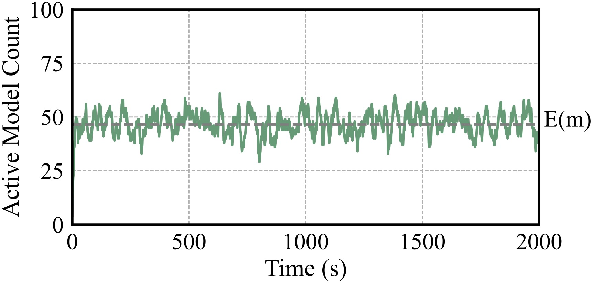

<!-- <p align="center">
| <a href="https://serverlessllm.github.io"><b>Documentation</b></a> | <a href="https://www.usenix.org/conference/osdi24/presentation/fu"><b>Paper</b></a> | <a href="https://discord.gg/AEF8Gduvm8"><b>Discord</b></a> | <a href="./docs/images/wechat.png"><b>WeChat</b></a> |
</p> -->

# Aegaeon

Aegaeon is an inference engine for concurrently serving multiple large langauge models (LLMs) by autoscaling instances at the token level.

Existing solutions ([ServerlessLLM](https://github.com/ServerlessLLM/ServerlessLLM), [Ray Serve](https://docs.ray.io/en/latest/serve/index.html), .etc) host multiple LLMs by autoscaling model instances across GPUs at the **request level**. In practice, the real production workloads of concurrent LLM requests exhibit a high *active model ratio* even at low request arrival rates (i.e., a significant proportion of hosted models are active due to long and sporadic requests), leading to severe **head-of-line (HOL) blocking** between models.

> Below is the active model count over time derived from real production statistics. With M = 100 (# of models), $\lambda$ = 0.037 (RPS per model), and T = 16.79 seconds (average request execution time), the expected active model count fluctuates around 46.55.
> In other words, request-level autoscaling would **require ~50 GPU instances, just to serve $M\lambda$ = 3.7 requests per second**.
> <p align="center">
>  <picture>
>    
>  </picture>
> </p>
> 

In Aegaeon, we propose **token-level** autoscaling. Given the same models to serve and the same hardware resources, Aegaeon intelligently switches between the served models over time, yielding much higher GPU utilization while respecting the user-specified service-level objectives (SLOs).

By utilizing [vLLM](https://github.com/vllm-project/vllm) as the execution backend, we support a wide range of models as well as many modern features like model parallelism, FlashAttention, Continuous Batching, PagedAttention, etc.

## Build && Install

**Requirements:**
* OS: Ubuntu
* Python: 3.10
* CUDA 12

Install Aegaeon from source:

```sh
# Install in conda; venv is also OK
conda create -n aegaeon python=3.10
pip install -e .

# Install the quick_model_loader; this requires Rust
cd quick_model_loader/
curl --proto '=https' --tlsv1.2 -sSf https://sh.rustup.rs | sh
. "$HOME/.cargo/env"
rustc --version

pip install -e .

# Verify installation
cd ..
python3 
>>> import quick_model_loader
>>> import aegaeon
```

## Getting Started

Download model weights:

```bash
# Assume: under /root
mkdir models
cd models

apt-get install git-lfs
git lfs install

# For aegaeon
git lfs clone https://www.modelscope.cn/models/Qwen/Qwen2.5-7B-Instruct/
git lfs clone https://www.modelscope.cn/models/01ai/Yi-1.5-9B-Chat/
git lfs clone https://www.modelscope.cn/models/modelscope/Llama-2-13b-chat-ms/

# ShareGPT
cd ..
git lfs clone https://www.modelscope.cn/datasets/gliang1001/ShareGPT_V3_unfiltered_cleaned_split/
mv ShareGPT_V3_unfiltered_cleaned_split/ShareGPT_V3_unfiltered_cleaned_split.json ./

# By now, the dataset should be at /root/ShareGPT_V3_unfiltered_cleaned_split.json, 
# and the models should be under /root/models
```

Single-node benchmarking:
```bash
# Assume: under /root/aegaeon, conda activate aegaeon
ray start --head --port=6789 --num-cpus=$(nproc --all) --resources='{"node_0": 1}'

mkdir logs
mkdir -p plots/json

# 40 models, 0.1 req/s per model
AEGAEON_LOG_FILE="/root/aegaeon/logs/40-0.1.log" RAY_DEDUP_LOGS=0 python3 benchmark/benchmark_e2e.py --nnodes 1 --num-model 40 --arrival-rate 0.1

# Result in plots/json
```

Multi-node benchmarking:

```bash
# Assume: conda activate aegaeon
# On other worker node(s) (change node_id accordingly)
ray start --address=<head_ip>:6789 --num-cpus=$(nproc --all) --resources='{"node_1": 1}'

# On head node
AEGAEON_LOG_FILE="/root/aegaeon/logs/80-0.1.log" RAY_DEDUP_LOGS=0 python3 benchmark/benchmark_e2e.py --nnodes 2 --num-model 80 --arrival-rate 0.1
```

Changing SLOs:

```bash
# Assume: under /root/aegaeon, conda activate aegaeon
AEGAEON_TTFT_SLO=3 AEGAEON_TPOT_SLO=0.03 AEGAEON_LOG_FILE="/root/aegaeon/logs/16-0.1-0.3x.log" RAY_DEDUP_LOGS=0 python3 benchmark/benchmark_e2e.py --nnodes 1 --num-model 16 --arrival-rate 0.1;
```

## Project Layout

* `aegaeon` - Core system implementation.
    * `aegaeon/workload` - Workload generation. See the file for usage.
    * `aegaeon/utils::DeviceType` - Different device support. Add a variant here if a new device is to be supported.
    * `aegaeon/models::ModelType` - Different model support. Add a variant here if a new model is to be supported, or change the paths here for different model weight location.

* `benchmark` - Benchmarking utilities.
    * `benchmark/benchmark_e2e` - Multi-node benchmarking script. Modify this to test out different deployments.
    * `benchmark/benchmark_latency` - Borrowed from `vllm`; used by the profiler (`profiles/do_profile.py`) to estimate model performance.

* `ops` - Custom KV cache swapping kernel.

* `plots` - Plotting utilities.

* `profiles` - Profile data for performance estimation.
    * `profiles/do_profile` - Script for parallel profiling; supports TP. Modify this if new profile data is needed.
    * `profiles/($model)/($device)/i($input)b($batchsize).json` - Profile data for running $model on $device with a batch of size $batchsize and input length $input.

* `quick_model_loader` - Model weight caching and quick loading. Implemented in Rust.

* `sim` - Simulator for concurrent serving.
    * `sim/simdata/execution` - Mirrors `profiles` for the profile data.
    * `sim/simulate` - Script for parallel simulation; supports multiple policies.
    * `sim/__init__::(DeviceType|ModelType)` - Support for different devices and models. Add variants here if needed.

* `test` - System tests.